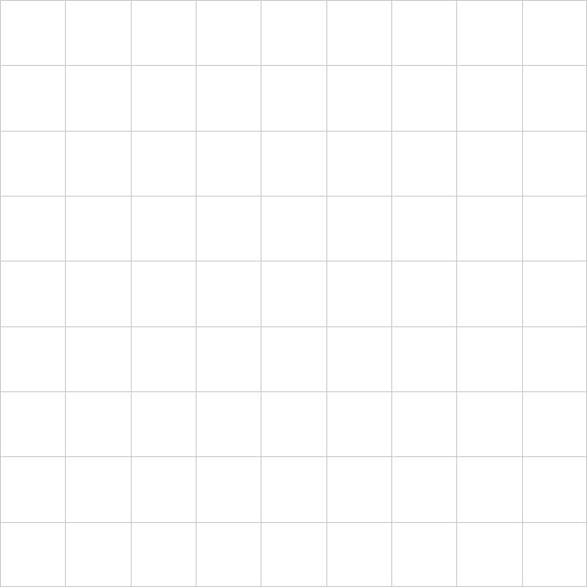

# Balance Game

Open `clearGame.html` in a modern browser to play. The board uses zero-based indices: 0 at the top-left, 1 in the next cell to the right, continuing across rows from top to bottom. Players take turns selecting cells: player 1 receives a red top-half marker and player 2 receives a green bottom-half marker.

Cleared enumerations use dimmer fills. Each stage consists of a player-1 pick followed by a player-2 pick or pass. A red pick clears earlier green picks at equal or higher numbers. A green pick clears red picks at equal or higher numbers, including the current stage’s red pick. Passing clears nothing. Dimming persists through resizing and is included in static and animated exports.

At the end of each stage (after player 2 picks or passes), player 2 loses if the number of uncleared red cells or the number of uncleared green cells exceeds Load. The two colors are counted separately; exactly Load is allowed. Player 2 wins by surviving the end of the final stage, including his response to player 1’s final pick. Player 2 clicks either member of a zero-based pair (0, 1), (2, 3), … to pick both cells. Both get green fills, and clearing either clears both. Each cell counts toward Load. Neither member of a new pair may already be green or be adjacent to a previously picked green cell. On boards with an odd number of cells, the last cell is picked alone.

## Buttons

- `Load` — slider from 3 to 8, initially 4. Changes apply at the next stage end without resetting the board. Adjusting controls does not pass a turn.

- `+` / `-` — increase or decrease the board size (3 through 24), starting a fresh game.
- Expand icon — toggles the largest square grid that fits the current browser window, with 8px top and side margins, 32px bottom padding, and controls kept visible. Click again to restore normal size.
- `Auto1` — toggle a random player-1 move after each player-2 move, so you can play player 2 against the computer.
- `SVG` — download the current grid as a static vector SVG.
- `Loop` — starts or resumes automatic play; its label changes to `Pause` while moves are running. Press `Pause` to stop at the current position, then press `Loop` to resume from there. Visible picks occur every half second; passes do not add an extra delay. Stages start at 1, each consisting of a red pick followed by a green pick or pass. Player 2 picks only at stages divisible by 3, choosing randomly among legal pairs with both indices strictly below the largest uncleared red index. He passes at other stages or if no eligible cell exists.
- `Step` — pauses automatic play, if needed, and advances the same automatic strategy by one turn (a pick or pass). Use it repeatedly to build an animation one move at a time.
- `GIF` — becomes available after at least one Loop or Step move while playback is paused. It downloads both `balance-loop.gif` (an animated raster image) and `balance-loop.svg` (an animated vector image). Both contain only the grid, repeat indefinitely, and space visible picks half a second apart; passes add no extra delay. GIF generation runs locally and needs no network connection. If your browser prompts about multiple downloads, allow them to receive both files.
- `Rules` — show the in-game rules summary.
