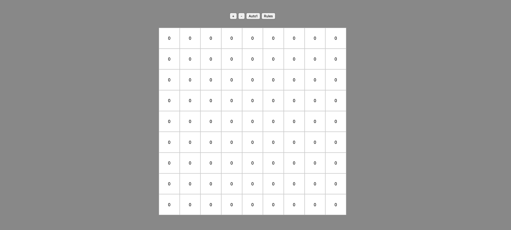

# balance-game

Grid-cells are numbered naturally, from top-left to bottom right and

<ul>
<li>Player-1 and player-2 click cells/numbers alternately</li>
<li>cells clicked by player-1 are indicated by a gray top-half fill</li>
<li>cells clicked by player-2 are indicated by a green bottom-half fill</li>
</ul>

Player-2 is to keep his choices evenly distributed relative to those of player 1.

This is measured by the <strong>score</strong> at each cell n:
 

the number of clicks in [1,n] that any player has achieved since the last click in [1,n] by the other player.

<strong>Rules</strong>

<ul>
<li>Player-2 needs to keep the score of each cell below 5</li>
<li>No player can pick any number he has previously picked</li>
<li>Player-2 cannot click a number which is adjacent to one he has previously clicked.</li>
<li>Player-2 may pass his turn by clicking outside the grid.</li>
</ul>

Player 1 wins when player 2 violates one of the restrictions above

Player 2 wins if he has not lost by the time player-1 has picked all cells.

Press <strong>Auto1</strong> to play as player-2 against a random-picking player-1.

